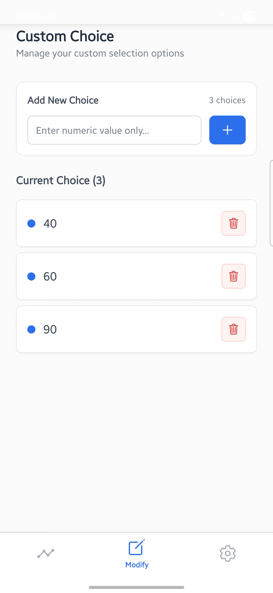
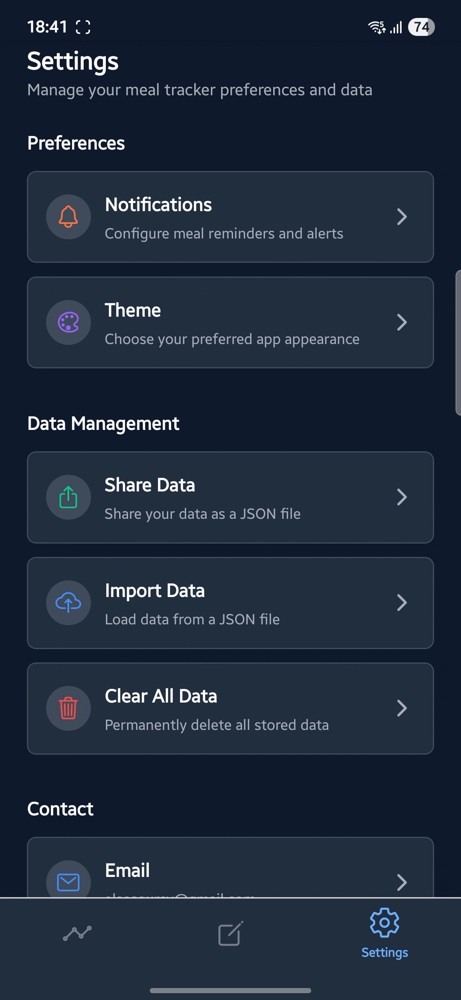

<div align="center">
   
   
   # 🍽️ Meal Tracker
   
   <p align="center">
      <em>A React Native mobile application for tracking daily meal consumption with smart notifications.</em>
   </p>
   
   <p align="center">
         
         
         
         
   </p>
</div>

## 📸 App Preview

<div align="center">
   
</div>

### ✨ Key Highlights

<table align="center">
<tr>
<td align="center" width="33%">
   
   <br><strong>🌓 Theme Switch</strong>
   <br><small>Dynamic light/dark mode toggle</small>
</td>
<td align="center" width="33%">
   
   <br><strong>➕ Custom Input Add</strong>
   <br><small>Personalized meal choices management</small>
</td>
<td align="center" width="33%">
   
   <br><strong>🔔 Smart Alerts</strong>
   <br><small>Intelligent reminder system</small>
</td>
</tr>
</table>

## 🎯 What Makes This Special

> This app showcases full-stack mobile development expertise:

-  Complex state management with persistent storage
-  Background processing and notification handling
-  Data analytics and visualization
-  Professional deployment and security practices
-  User-centered design with comprehensive feedback systems

## 📱 Features

-  ✅ **Daily Meal Tracking**: Track day meals, night meals, and extra meals with elegant mobile UI
-  🚫 **Smart "OFF" State**: Intentional meal skipping with intelligent notification pause
-  📅 **Calendar View**: Swipe-friendly date navigation optimized for mobile screens
-  💾 **Data Export/Import**: JSON-based data portability with cloud backup ready
-  🔔 **Background Notifications**: Smart meal reminders that respect your schedule
-  🌓 **Dark/Light Theme**: Automatic theme switching optimized for mobile viewing
-  📱 **Offline Support**: Works seamlessly without internet connection
-  👆 **Gesture Navigation**: Intuitive swipe and tap interactions throughout

## 🚀 Quick Start

### Prerequisites

-  Node.js (16+)
-  Expo CLI
-  Android Studio (for local builds)

### Installation

```bash
git clone https://github.com/elsesourav/meal-tracker.git
cd meal-tracker
npm install
npm start
```

### Development

```bash
npm run android    # Run on Android
npm run ios        # Run on iOS
npm run web        # Run in browser
```

## 🏗️ Building

### Cloud Build (Recommended)

```bash
# Install EAS CLI
npm install -g eas-cli
eas login

# Build APK for testing
npm run build:android
```

### Local Build

```bash
# Generate keystore
npm run keystore:generate

# Build release APK
npm run build:release
```

## 📂 Project Structure

```
meal-tracker/
├── app/                    # App screens
├── components/             # UI components
├── services/               # Business logic
├── hooks/                  # Custom hooks
├── contexts/               # React contexts
├── utils/                  # Utilities
├── assets/                 # Images & fonts
├── android/                # Native Android
└── scripts/                # Build scripts
```

## 🔧 Key Components

-  **MealDataService**: Data operations and "OFF" state logic
-  **NotificationService**: Background notifications with smart scheduling
-  **Theme System**: Light/dark mode support

## 🛠️ Available Scripts

```bash
# Development
npm start                     # Start dev server
npm run android              # Run on Android
npm run web                  # Run in browser

# Building
npm run build:android        # EAS cloud build
npm run build:release        # Local release build
npm run keystore:generate    # Generate keystore
```

## 🐛 Troubleshooting

**Keystore Issues**

```bash
npm run keystore:generate
```

**Build Issues**

```bash
cd android && ./gradlew clean
npm run build:release
```

**Environment Setup**

```bash
export ANDROID_HOME=~/Library/Android/sdk
export JAVA_HOME=/opt/homebrew/Cellar/openjdk@17/17.0.15/libexec/openjdk.jdk/Contents/Home
```

## Keystore Setup

1. **Generate Release Keystore**

```bash
cd android/app && mkdir -p keystores
keytool -genkeypair -v -storetype PKCS12 \
  -keystore keystores/release.keystore \
  -alias meal-tracker-key \
  -keyalg RSA -keysize 2048 -validity 10000
```

2. **Configure Passwords**

**Method 1: Direct (Simple)**
Edit `android/gradle.properties`, replace:

```properties
MEAL_TRACKER_RELEASE_STORE_PASSWORD=your_actual_store_password
MEAL_TRACKER_RELEASE_KEY_PASSWORD=your_actual_key_password
```

**Method 2: Environment Variables (Secure)**
Keep environment variables in `gradle.properties`:

```properties
MEAL_TRACKER_RELEASE_STORE_PASSWORD=${MEAL_TRACKER_STORE_PASSWORD}
MEAL_TRACKER_RELEASE_KEY_PASSWORD=${MEAL_TRACKER_KEY_PASSWORD}
```

Then set variables before building:

```bash
export MEAL_TRACKER_STORE_PASSWORD="your_password"
export MEAL_TRACKER_KEY_PASSWORD="your_password"
```

3. **Build Release APK**

```bash
npm run build:release
# OR manual: cd android && ./gradlew assembleRelease
```

**📋 Important Files:**

-  `📚 KEYSTORE_SETUP.md` - Detailed setup guide
-  `📝 SETUP_COMPLETE.md` - Quick reference
-  `🔧 scripts/` - Automation scripts

#### 🔐 Security Best Practices

**Keystore Security:**

```bash
# Store keystore in secure location
# Never commit keystore to version control
# Backup keystore securely (you cannot recover if lost!)

# Use environment variables for passwords
export MEAL_TRACKER_STORE_PASSWORD="your_secure_password"
export MEAL_TRACKER_KEY_PASSWORD="your_secure_password"

# Or use the secure setup script
source ./scripts/set-keystore-env.sh
```

#### ☁️ EAS Build (Cloud-Based)

**Expo Application Services (EAS) Build** provides cloud-based building without requiring local Android/iOS development environment setup.

**🌟 Advantages:**

-  No local Android Studio/Xcode required
-  Consistent build environment
-  Support for custom native code
-  Automated signing and distribution
-  Build artifacts stored in cloud

**Prerequisites:**

```bash
# Install EAS CLI globally
npm install -g eas-cli

# Login to your Expo account
eas login
```

**📱 Available EAS Build Commands**

```bash
# 🔧 Development/Preview Builds (No signing required)
npm run build:android              # Preview build for testing
eas build --platform android --profile preview

# 🚀 Production Builds (App Store ready)
npm run build:android:production   # Production build with signing
eas build --platform android --profile production

# 📊 Build Status & Management
eas build:list                     # List all builds
eas build:view [build-id]          # View specific build details
eas build:cancel [build-id]        # Cancel running build

# 🔐 Credentials Management
eas credentials                    # Manage signing credentials
eas credentials:configure          # Configure app signing
```

**🚀 Quick EAS Build Workflow:**

**For Testing (No Keystore Required):**

```bash
# 1. Build preview APK
npm run build:android

# 2. Download and install APK
# - Check build status on Expo dashboard
# - Download APK when build completes
# - Install on device for testing
```

**For Production (App Store):**

```bash
# 1. Configure signing credentials
eas credentials:configure

# 2. Build production AAB
npm run build:android:production

# 3. Upload to Google Play Console
# - Download AAB from Expo dashboard
# - Upload to Google Play Console
```

**🛠️ Advanced EAS Commands:**

```bash
# Build for multiple platforms simultaneously
eas build --platform all

# Build specific branch
eas build --platform android --branch feature/new-ui

# Custom build profile
eas build --platform android --profile custom-profile

# Clear build cache
eas build --platform android --clear-cache

# Submit to app stores directly
eas submit --platform android
```

**🔍 Monitoring Builds:**

```bash
# Watch build progress in real-time
eas build --platform android --wait

# View build logs
eas build:view --log [build-id]

# Check build queue
eas build:list --status=in-queue
```

## 🏗️ Technology Stack

<table>
<tr>
<td width="50%">

**Frontend & Framework**

-  📱 React Native with Expo
-  🧭 Expo Router (Navigation)
-  🎨 NativeWind (Tailwind CSS)
-  📘 Full TypeScript support

**State & Storage**

-  ⚛️ React Hooks & Context API
-  💾 AsyncStorage (Local storage)
-  🔄 Data persistence & management

</td>
<td width="50%">

**Notifications & Background**

-  🔔 Expo Notifications
-  ⏰ Background Tasks
-  📱 Cross-platform support
-  🔋 Battery optimization

**Build & Development**

-  🛠️ EAS Build system (Cloud builds)
-  🏗️ Local Gradle builds (Native)
-  🔍 ESLint & code quality
-  📦 Metro bundler
-  🚀 Hot reloading
-  ☁️ Expo Application Services

</td>
</tr>
</table>

## 🔧 Key Components

### 📊 MealDataService

**Core data operations engine:**

-  ✅ CRUD operations for meal data
-  📤 Data export/import functionality
-  📅 Date-based data retrieval
-  🔄 Handles "OFF" state logic (-1 values)
-  🗑️ Smart data cleanup and validation

### 🔔 NotificationService

**Intelligent background notification system:**

-  📱 Background task registration
-  ⏰ Smart notification scheduling
-  🎯 Platform-specific optimizations
-  🔐 Permission handling
-  🚫 Respects "OFF" meal states (no notifications)

### 🎨 Theme System

**Dynamic visual experience:**

-  🌙 Light/Dark theme support
-  🔄 System theme detection
-  💾 Persistent theme preferences

## ⚡ Performance & Optimization

### 🚀 Build Performance

**Speed up builds:**

```bash
# Use parallel builds (add to android/gradle.properties)
org.gradle.parallel=true
org.gradle.caching=true

# Clean build cache if issues occur
cd android && ./gradlew --stop && ./gradlew clean
```

**Reduce APK size:**

-  Release builds automatically enable ProGuard (code minification)
-  PNG crunching is enabled for optimized images
-  Unused code is automatically removed

### 📱 App Performance

**Memory optimization:**

-  App uses lazy loading for meal data
-  Automatic cleanup of old data beyond retention period
-  Optimized AsyncStorage usage with batched operations

**Battery optimization:**

-  Smart notification scheduling reduces background activity
-  Efficient date calculations minimize CPU usage
-  Background tasks are automatically managed by Expo

### 🔧 Development Performance

**Faster development cycles:**

```bash
# Use Metro bundler caching
npm start -- --reset-cache  # Only when needed

# Faster Android builds
npm run android -- --variant=debug

# Web preview for quick testing
npm run web
```

## 🔔 Notification Features

The app includes sophisticated background notification support:

-  **Background Tasks**: Notifications work even when app is closed
-  **Smart Scheduling**: Reminders adapt to your usage patterns
-  **Customizable Times**: Set your preferred reminder times
-  **Cross-Platform**: Optimized for both Android and iOS

## 📊 Data Management

<table>
<tr>
<td width="50%">

**💾 Storage & Persistence**

-  Local device storage (AsyncStorage)
-  No internet dependency
-  Data integrity validation
-  Automatic backup on app state changes

**🔄 Import/Export**

-  JSON-based data portability
-  Version-aware data migration
-  Custom choices preservation
-  Cross-device data transfer

</td>
<td width="50%">

**📅 Organization & Access**

-  Hierarchical date-based structure
-  Fast date-range queries
-  Efficient memory usage
-  Smart data cleanup

**⚡ Performance**

-  Lazy loading strategies
-  Optimized data structures
-  Background processing
-  Minimal memory footprint

</td>
</tr>
</table>

## ❓ Frequently Asked Questions (FAQ)

### 🔧 Build & Setup

**Q: Which build method should I choose?**

-  **Beginners/Quick testing**: Use EAS Cloud builds (`npm run build:android`)
-  **Advanced users/Frequent builds**: Set up local builds (`npm run build:release`)
-  **App store submission**: Use EAS production builds (`npm run build:android:production`)

**Q: Do I need Android Studio for EAS builds?**

-  No! EAS Cloud builds only require `eas-cli`. Perfect for beginners.

**Q: How long do builds take?**

-  **EAS Cloud**: 5-15 minutes (first build may take longer)
-  **Local builds**: 2-5 minutes (after initial setup)
-  **Development**: <1 minute (hot reload)

**Q: Can I build without a keystore?**

-  **EAS preview builds**: Yes, no keystore needed
-  **Local release builds**: No, keystore required
-  **Production builds**: Yes, EAS manages keystores automatically

### 🛠️ Technical

**Q: I'm getting Java version errors, what should I do?**

-  Ensure Java 17+ is installed: `brew install openjdk@17`
-  Set JAVA_HOME: `export JAVA_HOME=/opt/homebrew/Cellar/openjdk@17/17.0.15/libexec/openjdk.jdk/Contents/Home`

**Q: Where are my built APK files located?**

-  **Debug**: `android/app/build/outputs/apk/debug/app-debug.apk`
-  **Release**: `android/app/build/outputs/apk/release/app-release.apk`
-  **Auto-copied**: `meal-tracker-release.apk` (project root)

**Q: How do I reset my build environment?**

```bash
# Clean everything and start fresh
cd android && ./gradlew clean
rm -rf android && npm run prebuild:android
npm run build:release
```

---

## 🐛 Troubleshooting

### Common Build Issues

**Keystore Problems**

```bash
# If keystore generation fails
npm run keystore:generate

# If keystore not found
ls android/app/keystores/release.keystore

# Fix script permissions
chmod +x scripts/*.sh
```

**Environment Issues**

```bash
# Check Android SDK
echo $ANDROID_HOME

# If ANDROID_HOME is not set, set it manually:
export ANDROID_HOME=~/Library/Android/sdk

# Verify Java installation (must be Java 17+)
java -version

# If Java 17 is not active, switch to it:
export JAVA_HOME=/opt/homebrew/Cellar/openjdk@17/17.0.15/libexec/openjdk.jdk/Contents/Home

# Check Gradle wrapper
cd android && ./gradlew --version
```

**Build Failures**

```bash
# Clean and rebuild
cd android && ./gradlew clean
npm run build:release

# Reset native project
rm -rf android && npm run prebuild:android
```

**Password Issues**

-  Verify passwords in `android/gradle.properties` match your keystore
-  Use environment variables for security: `source ./scripts/set-keystore-env.sh`
-  Check for typos in password configuration

### Quick Fixes

| Issue                  | Solution                                            |
| ---------------------- | --------------------------------------------------- |
| Script not executable  | `chmod +x scripts/*.sh`                             |
| Keystore not found     | Run `npm run keystore:generate`                     |
| Wrong password         | Check `gradle.properties` passwords                 |
| Android SDK missing    | Set `ANDROID_HOME` environment variable             |
| Java 17 required       | `export JAVA_HOME=<path-to-java-17>`                |
| Build tools outdated   | Update Android Studio & SDK tools                   |
| Gradle daemon issues   | `cd android && ./gradlew --stop && ./gradlew clean` |
| Permission denied      | `chmod +x android/gradlew`                          |
| SDK location not found | Create `android/local.properties` file              |

## 🛠️ Development

### Available Scripts

#### 🚀 Development & Testing

-  `npm start` - Start Expo development server
-  `npm run android` - Run on Android device/emulator
-  `npm run ios` - Run on iOS device/simulator
-  `npm run web` - Run in web browser
-  `npm run lint` - Run ESLint code analysis

#### 🔑 Keystore & Release Setup

-  `npm run keystore:generate` - Generate release keystore (interactive)
-  `npm run build:release` - Complete automated release build
-  `npm run build:local` - Local native build (prebuild + gradle)
-  `npm run prebuild:android` - Generate native Android code only

#### ☁️ Cloud Builds (EAS)

-  `npm run build:android` - EAS preview build
-  `npm run build:android:production` - EAS production build

#### 🔧 Helper Scripts

-  `./scripts/generate-keystore.sh` - Interactive keystore generation
-  `./scripts/build-release.sh` - Automated release build with validation
-  `./scripts/set-keystore-env.sh` - Set secure environment variables

### Contributing

1. Fork the repository
2. Create your feature branch (`git checkout -b feature/AmazingFeature`)
3. Commit your changes (`git commit -m 'Add some AmazingFeature'`)
4. Push to the branch (`git push origin feature/AmazingFeature`)
5. Open a Pull Request

## 📄 License

This project is licensed under the MIT License - see the [LICENSE](LICENSE) file for details.

## 👨‍💻 Author

**elsesourav**

-  GitHub: [@elsesourav](https://github.com/elsesourav)

## 🙏 Acknowledgments

-  Built with React Native and Expo
-  Uses various open-source libraries and tools
-  Inspired by the need for simple meal tracking

## 📞 Support

If you have any questions or need help, please open an issue on GitHub.

---

**© 2025 elsesourav. All rights reserved.**
